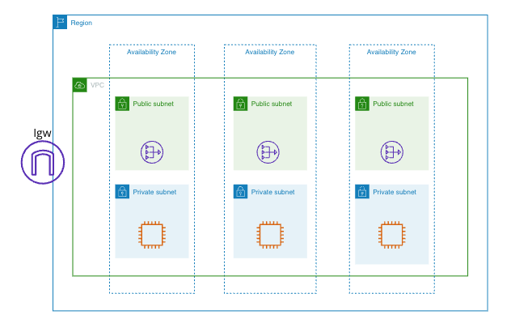

# 2주차: 가상 네트워크/서브넷/라우트 테이블

## 데이터 센터 구조부터 알아봅시다.

- 데이터 센터는 전통적으로 3계층으로 나뉨
    - `Core Layer` : 인터넷과 연결되어, Aggregation Layer에 **고속 연결**/인터넷 액세스 제공
        - Core Router, Core Switch…
    - `Aggregation Layer` : L3 네트워크 계층으로, 라우터 장비로 생각하면 좋음
    - `Access Layer` : L2 네트워크 계층으로, 서버 랙(스위치 + 서버)
- `VLAN` : 스위치의 각 인터페이스들을 논리적으로 나눔.
해당 영역 간 통신은 라우터를 통해서 함.
    - **왜 나눠야 해요?**
- 사실 크게보면 우리 집 네트워크랑 다를 바가 없음..
    - 모뎀 → 공유기(L3) → 허브(L2) → 컴퓨터

## VPC란 무엇일까?

**`퍼블릭 클라우드 내에 생성되는 고객 전용의 논리적으로 격리된 가상 네트워크`** 

> 결국 클라우드도 누군가의 온프레미스 데이터센터이다!(다만 엄청 클 뿐)

→ 월세 받고 방 단위로 세입자에게 파는 건물주
>

- 건물주에겐 방은 말 그대로 집의 일부인 **방**이지만,
- 세입자에겐 방이라는 거 자체가 **집**임

=> 클라우드 서비스 프로바이더(CSP)가 물리적으로 구축한 데이터센터의 네트워크의 일부를 **Software Defined Network**으로 나누어 고객에게 제공하는 것

---
## 가~장 일반적인 VPC 구조도

`VPC` = 가상의 데이터센터라고 생각.

- `Core Layer` = Igw
- `Aggregation Layer` = 라우트 테이블, 서브넷
- `Access Layer` = NACL, Security Group + 인스턴스

### 서브넷

*서브넷*은 VPC내 네트워크 경계를 정의하고 IP 주소 범위를 부여함.

인터넷 게이트웨이로 향하는 라우팅 규칙 유무에 따라 **퍼블릭/프라이빗** 구분

- **퍼블릭 서브넷**
- **프라이빗 서브넷**
    - 인터넷으로 나갈 수 있는 프라이빗 서브넷
    - 폐쇄망
        - 폐쇄망에서 AWS 서비스를 쓰고싶은데..? ⇒ VPC 엔드포인트
---

### 라우트 테이블

*라우팅 테이블*은 Virtual Private Cloud(VPC)의 트래픽 컨트롤러 역할

= Subnet Association + 라우팅 규칙

Subnet Association이 구성된 서브넷만이 라우팅테이블을 탈 수 있음.
